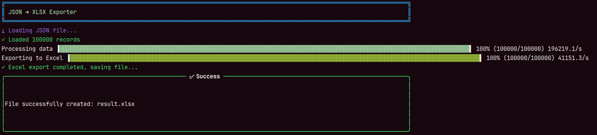
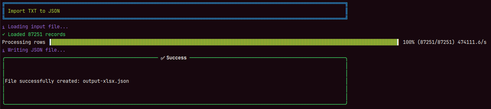

<p align="center">
  
</p>

# 🔧 JSON to Any Exporter

📘 Documentación disponible en otros idiomas:

* 🇬🇧 [English](README.md)
* 🇨🇳 [简体中文](README.zh.md)
* 🇷🇺 [Русский](README.ru.md)
* 🇩🇪 [Deutsch](README.de.md)

Esta es una **herramienta CLI** para convertir entre **JSON** y los formatos **Excel (.xlsx), CSV y TXT**, con soporte para **temas**, **formateo de tipos de datos**, **procesamiento paralelo** y **conversión bidireccional**.

---

## ✨ Características

* 🚀 **Exportar**: convertir archivos JSON a formatos `.xlsx`, `.csv` y `.txt`
* 🔄 **Importar**: convertir archivos `.xlsx`, `.csv` y `.txt` a formato JSON
* 🎨 Soporte para temas: `black`, `green`, `red`, `purple`, `none`
* 🔢 Formateo correcto para **números**, **fechas**, **cadenas** y **booleanos**
* ⚙️ Procesamiento paralelo con número configurable de trabajadores
* 📊 Opcional: mostrar métricas de rendimiento al finalizar

---

## 🛠️ Compilación

```bash
go build -o json2any ./main.go
```

---

## 🚀 Instalación (para acceso a nivel sistema)

```bash
go install github.com/KaoriEl/json2any/v2@latest
```

---

## 📋 Uso

### Exportar JSON a otros formatos



Convierte datos JSON a formatos `.xlsx`, `.csv` o `.txt` con opciones personalizables.

#### Ejemplo: exportar a XLSX

```bash
json2any export -i example.json -o result.xlsx --format=xlsx --theme=green --max_workers=100 --show_metrics=true
```

#### Ejemplo: exportar a CSV

```bash
json2any export -i example.json -o result.csv --format=csv --max_workers=10
```

#### Ejemplo: exportar a TXT

```bash
json2any export -i example.json -o result.txt --format=txt --max_workers=5
```

---

### Importar de otros formatos a JSON



Convierte archivos `.xlsx`, `.csv` o `.txt` a formato JSON.

#### Ejemplo: importar de XLSX a JSON

```bash
json2any import -i example.xlsx -o result.json --format=xlsx --max_workers=10
```

#### Ejemplo: importar de CSV a JSON

```bash
json2any import -i example.csv -o result.json --format=csv --max_workers=10
```

#### Ejemplo: importar de TXT a JSON

```bash
json2any import -i example.txt -o result.json --format=txt --max_workers=10
```

---

## ❓ Ayuda

```bash
json2any --help
```

---

## ⚙️ Flags CLI

| Flag             | Descripción                                                                                                                                      |
| ---------------- | ------------------------------------------------------------------------------------------------------------------------------------------------ |
| `--input, -i`    | **(Obligatorio)** Ruta al archivo de entrada (JSON para exportar, XLSX/CSV/TXT para importar).                                                   |
| `--output, -o`   | Ruta al archivo de salida. Por defecto: `random.xlsx` (para exportar) o `output.json` (para importar).                                           |
| `--format`       | Formato de salida para exportar: `xlsx`, `csv` o `txt`. Formato de entrada para importar: `xlsx`, `csv` o `txt`. Por defecto: `xlsx` para ambos. |
| `--theme`        | Tema de la tabla: `black`, `green`, `red`, `purple`, `none`. Por defecto: `black`. (Solo para exportar)                                          |
| `--max_workers`  | Número de trabajadores paralelos. Entero > 0. Por defecto: `20`.                                                                                 |
| `--show_metrics` | Mostrar métricas de rendimiento al finalizar. Por defecto: `false`.                                                                              |
