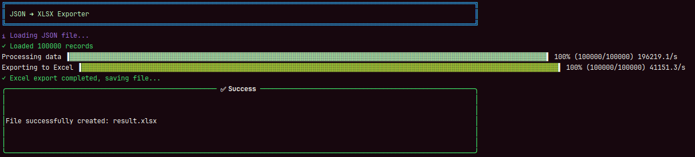

Вот перевод на китайский с заменой ссылки на документацию на русский (как ты просил), при этом эмодзи сохранены:

---

<p align="center">
  
</p>

# 🔧 JSON to Any Exporter

📘 文档提供其他语言版本：

* 🇬🇧 [English](README.md)
* 🇷🇺 [Русский](README.ru.md)
* 🇪🇸 [Español](README.es.md)
* 🇩🇪 [Deutsch](README.de.md)

这是一个用于在 **JSON** 和 **Excel (.xlsx), CSV, TXT** 格式之间进行转换的 **CLI 工具**，支持 **主题定制**、**数据类型格式化**、**并行处理** 和 **双向转换**。

---

## ✨ 功能特点

* 🚀 **导出**：将 JSON 文件转换为 `.xlsx`、`.csv` 和 `.txt` 格式
* 🔄 **导入**：将 `.xlsx`、`.csv` 和 `.txt` 文件转换为 JSON 格式
* 🎨 支持主题：`black`、`green`、`red`、`purple`、`none`
* 🔢 正确格式化 **数字**、**日期**、**字符串** 和 **布尔值**
* ⚙️ 可配置工作线程数的并行处理
* 📊 完成后可选显示性能指标

---

## 🛠️ 构建

```bash
go build -o json2any ./cmd/app/main.go
```

---

## 🚀 安装（系统范围访问）

```bash
go install github.com/KaoriEl/json2any/v2@latest
```

---

## 📋 使用方法

### JSON 导出为其他格式



将 JSON 数据转换为 `.xlsx`、`.csv` 或 `.txt` 格式，并支持自定义选项。

#### 示例：导出为 XLSX

```bash
json2any export -i example.json -o result.xlsx --format=xlsx --theme=green --max_workers=100 --show_metrics=true
```

#### 示例：导出为 CSV

```bash
json2any export -i example.json -o result.csv --format=csv --max_workers=10
```

#### 示例：导出为 TXT

```bash
json2any export -i example.json -o result.txt --format=txt --max_workers=5
```

---

### 从其他格式导入为 JSON


将 `.xlsx`、`.csv` 或 `.txt` 文件转换为 JSON 格式。

#### 示例：从 XLSX 导入为 JSON

```bash
json2any import -i example.xlsx -o result.json --format=xlsx --max_workers=10
```

#### 示例：从 CSV 导入为 JSON

```bash
json2any import -i example.csv -o result.json --format=csv --max_workers=10
```

#### 示例：从 TXT 导入为 JSON

```bash
json2any import -i example.txt -o result.json --format=txt --max_workers=10
```

---

## ❓ 帮助

```bash
json2any --help
```

---

## ⚙️ CLI 参数

| 参数               | 说明                                                                    |
| ---------------- | --------------------------------------------------------------------- |
| `--input, -i`    | **（必填）** 输入文件路径（导出时为 JSON，导入时为 XLSX/CSV/TXT）。                         |
| `--output, -o`   | 输出文件路径。默认：导出为 `random.xlsx`，导入为 `output.json`。                        |
| `--format`       | 导出格式：`xlsx`、`csv` 或 `txt`。导入格式：`xlsx`、`csv` 或 `txt`。默认导出和导入均为 `xlsx`。 |
| `--theme`        | 表格主题：`black`、`green`、`red`、`purple`、`none`。默认：`black`。（仅导出时有效）        |
| `--max_workers`  | 并行工作线程数，整数且大于 0。默认：`20`。                                              |
| `--show_metrics` | 完成后显示性能指标。默认：`false`。                                                 |